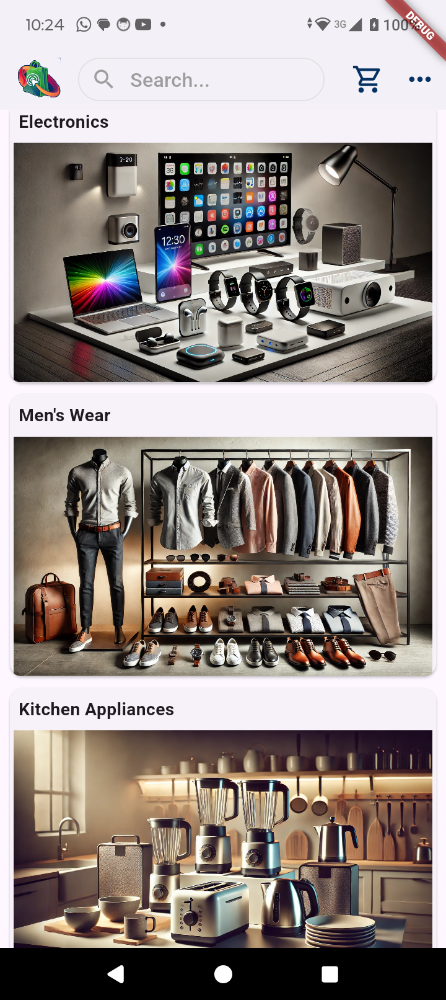
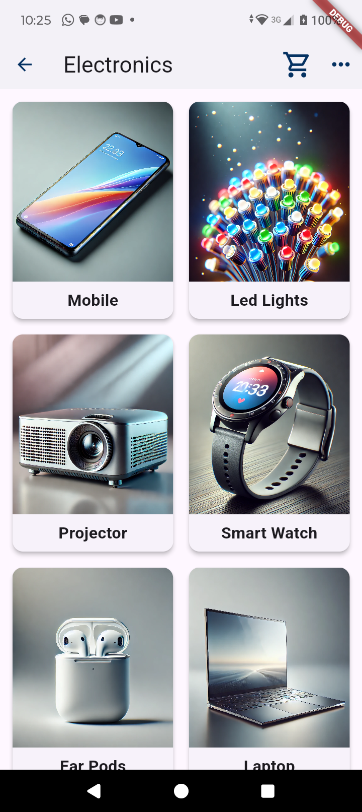
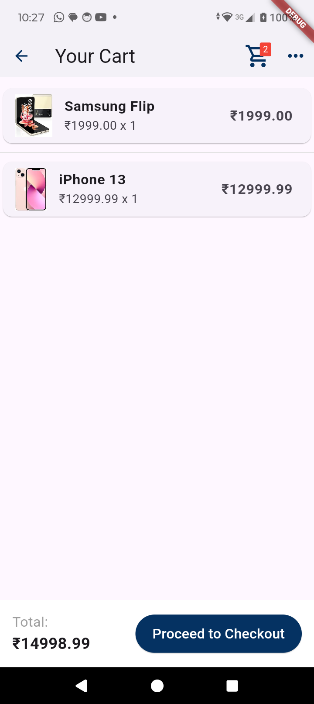

# Ecommerce Portal

A Flutter-based ecommerce portal that provides a seamless shopping experience with a modern UI, integrated with a backend for managing products, cart, and orders. The app is built using the BLoC pattern to separate business logic from the UI, ensuring a clean and maintainable codebase.

## 🚀 Getting Started

### Prerequisites

Before you begin, ensure you have met the following requirements:

- Flutter SDK: [Install Flutter](https://flutter.dev/docs/get-started/install)
- A code editor, such as [Visual Studio Code](https://code.visualstudio.com/) or [Android Studio](https://developer.android.com/studio)
- A connected device or emulator for testing

### Installation

1. Clone the repository:
   ```bash
   git clone https://github.com/yourusername/ecommerce_portal.git
   cd ecommerce_portal

2. Install Dependencies
   ```bash
   flutter pub get

3. Run the app
   ```bash
   flutter run
   
### Folder Structure


### Architecture
The app follows a Layered Architecture using the BLoC (Business Logic Component) Pattern:

1. Presentation Layer: UI components managed by Flutter widgets (screens/ and widgets/ folders).
2. Business Logic Layer: BLoC classes handle business logic and state management (blocs/ folder).
3. Data Layer: Models and utility classes that represent and manipulate data (models/ and utils/ folders).
4. This architecture ensures separation of concerns, making the app more scalable and easier to maintain.

### Features

1. User Authentication: Login and Signup functionality with secure session management.
2. Product Catalog: Browse products by category and subcategory, with detailed product descriptions and images.
3. Cart Management: Add products to the cart, manage quantities, and view cart totals.
4. Checkout Process: Seamless checkout with shipping information, payment method selection, and order confirmation.
5. Order History: View past orders with detailed information on each purchase.
6. Responsive UI: Beautifully designed UI.

### Screenshot





### Dependencies

Key packages used in the project:

1. flutter_bloc: State management using the BLoC pattern.
2. cached_network_image: Efficient image caching and loading.
3. lottie: Beautiful animations for enhancing user experience.
4. flutter_rating_bar: Display star ratings in the product detail page.

### API Integration

The app interacts with a backend built using PHP and MySQL. API endpoints manage user authentication, product catalog, cart operations, and order processing. 

